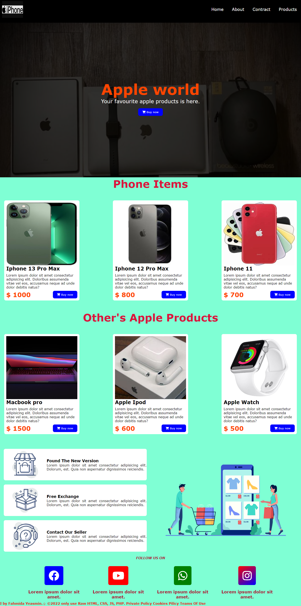
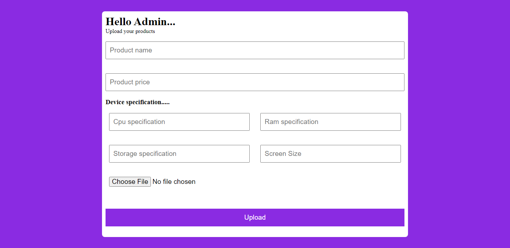

# Apple Store Project by <b>Fahmida Yeasmin</b>
## Supporting by Mahmood Hassan Rameem

 
 
 

# Project Overview

### This is a dummy simple e-commerce project of <b>Fahmida Yeasmin</b>. Just uploading apple products and showing products into home page. And it is approved by <b>Mohammad Shahin Hossain</b> (Course Supervisor). 

 

### This project is only ready for college lab project. 

 
 
 
 

# Project Contributors and their contributions

## 1) Fahmida Yeasmin

- HTML Layout
- CSS Design
- Add Some Pages and implements design

## 2) Mahmood Hassan Rameem

- Added JavaScript
- Added PHP
- Connected MySQLI Database
- Added admin product upload page

 
 

# Database information
- Database Name: famida
- Database Table Name: iphone
- Database Table Name: macbook
- Database Table Name: admin

 
 

# Website view

 
 

# We (☺)

<!-- 
Fahmida Yeasmin            |  Mahmood Hassan Rameem
:-------------------------:|:-------------------------:
  |   -->

Fahmida Yeasmin            |  Mahmood Hassan Rameem
:-------------------------:|:-------------------------:
Project Owner           |  Project Associate Partner
|
  |  